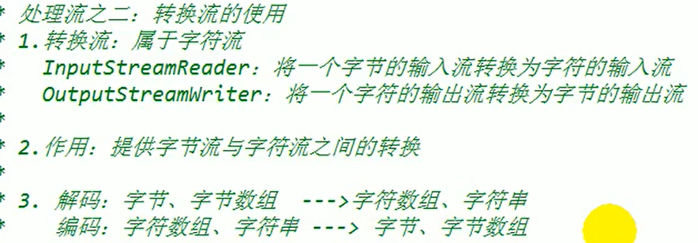

# IO流

##  File类

### 1.基本的使用操作


### 2.File常用方法

* 获取功能


* 重命名功能


* 判断功能


* 创建和删除功能

  ​	都是对应在磁盘中的操作


## 原理以及流的分类


* 我们站在程序的角度看输入和输出


### 1.节点流

* 结论：一般来说

#### 1.1文件字符流

* 不能使用字符流来处理图片等字节数据


* FileReader   读------->	将文件内容读入程序中，并输出到控制台


```java
public class FileReaderWriterTest {
    public static void main(String[] args) {
        File file = new File("hello.txt");//相较于当前工程
        System.out.println(file.getAbsoluteFile());

        File file1 = new File("day16//hello.txt");
        System.out.println(file.getAbsoluteFile());
    }

    @Test
    public void test1()  {
        FileReader fr = null;
        try {
            File file = new File("hello.txt");//相较于当前Module
//        System.out.println(file.getAbsoluteFile());

//      2.提供具体的流
            fr = new FileReader(file);

//      3.数据的读入
            //read()：返回读入的一个字符。如果达到文件末尾，返回-1
            //方式一
//        int data = fr.read();
//        while (data != -1) {
//            System.out.print((char)data);
//            data = fr.read();
//        }
            //方式二:语法上的修改
            int data;
            while ((data = fr.read()) != -1) {
                System.out.println((char) data);
            }
        } catch (IOException e) {
            e.printStackTrace();
        } finally {
            //      4.流的关闭操作
            try {
                if (fr != null) {
                    fr.close();//一定要手动关闭，jvm对流无能为力
                }
            } catch (IOException e) {
                e.printStackTrace();
            }
        }
```


* FileWriter写------>  从内存中写出数据到硬盘文件里

  ​	说明：

  ​		1.输出操作，对应的File文件可以不存在的。并不会报异常。

  ​		2.

  ​			File对应的硬盘中的文件如果不存在，在输出过程中，会自动创建此文件。

  ​			File对应的硬盘中的文件如果存在：

  ​				如果流使用的构造器是：FileWriter( file , false ) / FileWriter( file ):对原有文件的覆盖

  ​				如果流使用的构造器是：FileWriter( file , true ):不会对原有文件覆盖，而是在原有文件基础上追加内容


* 小练习


#### 1.2文件字节流

* 使用字节流FileInputSteam（FileOutputteam）处理文本文件，可能出现乱码
* 复制图片小练习

```java
 @Test
    public void testFileInputOutputSteam()  {
        FileInputStream fis = null;
        FileOutputStream fos = null;

        try {
            //1.造文件
            File srcfile = new File("1.jpg");
            File destfile = new File("2.jpg");

            //2.造流
            fis = new FileInputStream(srcfile);
            fos = new FileOutputStream(destfile);

            //3.复制过程
            byte[] buffer = new byte[5];
            int len;//记录每次读取字符的个数
            while ((len = fis.read(buffer))!=-1) {
                fos.write(buffer);
            }
        } catch (IOException e) {
            e.printStackTrace();
        } finally {
            if (fis != null) {
                try {
                    //4.关闭资源
                    fis.close();
                } catch (IOException e) {
                    e.printStackTrace();
                }
            }
            if (fos != null) {
                try {
                    //4.关闭资源
                    fos.close();
                } catch (IOException e) {
                    e.printStackTrace();
                }
            }

        }
    }
```

```java
//指定路径文件下的的复制
public void copyFile(String scrPath, String destPath) {
        FileInputStream fis = null;
        FileOutputStream fos = null;

        try {
            //1.造文件
            File srcfile = new File(scrPath);
            File destfile = new File(destPath);

            //2.造流
            fis = new FileInputStream(srcfile);
            fos = new FileOutputStream(destfile);

            //3.复制过程
            byte[] buffer = new byte[1024];
            int len;//记录每次读取字符的个数
            while ((len = fis.read(buffer)) != -1) {
                fos.write(buffer);
            }
        } catch (IOException e) {
            e.printStackTrace();
        } finally {
            if (fis != null) {
                try {
                    //4.关闭资源
                    fis.close();
                } catch (IOException e) {
                    e.printStackTrace();
                }
            }
            if (fos != null) {
                try {
                    //4.关闭资源
                    fos.close();
                } catch (IOException e) {
                    e.printStackTrace();
                }
            }
        }
    } 
```


### 2.缓冲流（处理流的一种）

* 作用：提供流的读取。写入速度

  ​	原因：内部提供了一个缓冲区

* 处理流：就是“嵌套”在已有的流的基础上

#### 2.1字节流下的处理流

* 基本使用如下：

```java
//  实现非文本的复制
    @Test
    public void BufferedStreamTest() {
        FileInputStream fis = null;
        FileOutputStream fos = null;
        BufferedInputStream bis = null;
        BufferedOutputStream bos = null;
        try {
            //1.造文件
            File scrFile = new File("1.jpg");
            File destFile = new File("3.jpg");
            //2.造流
            //2.1造节点流
            fis = new FileInputStream(scrFile);
            fos = new FileOutputStream(destFile);
            //2.2造缓冲流
            bis = new BufferedInputStream(fis);
            bos = new BufferedOutputStream(fos);
            //3.复制的细节:读取、写入
            byte[] buffer = new byte[5];
            int len;
            while ((len = bis.read(buffer)) != -1) {
                bos.write(buffer,0,len);
            }
        } catch (IOException e) {
            e.printStackTrace();
        } finally {
            //4.资源关闭:先关外层，在关内层
            if (bis != null) {
                try {
                    bis.close();
                } catch (IOException e) {
                    e.printStackTrace();
                }
            }

            if (bos != null) {
                try {
                    bos.close();
                } catch (IOException e) {
                    e.printStackTrace();
                }
            }


            //4.1关闭外层的同时也会关闭内层
//            fis.close();
//            fos.close();
        }
    }
```

#### 2.2字符流下的处理流

* 基本使用方式如下：

```java
 //文本文件的复制
    public void testBufferedReaderBufferedWriter() {
        BufferedReader br = null;
        BufferedWriter bw = null;
        try {
            //创建文件和相应地流
            br = new BufferedReader(new FileReader(new File("jjd.txt")));
            bw = new BufferedWriter(new FileWriter(new File("jjd1.txt")));

            //方式一：
//            //读写操作
//            char[] cubf = new char[1024];
//            int len;
//            while ((len = br.read()) != -1) {
//                bw.write(cubf,0,len);
//    //            bw.flush();
//            }

            //方式二：
            //读写操作
            String data;
            while ((data = br.readLine())!= null) {
                //bw.write(data);//data中不包含换行符
                //换行方式一：
                //bw.write(data + "\n");

                //换行方式二:
                bw.write(data);
                bw.newLine();

            }

        } catch (IOException e) {
            e.printStackTrace();
        } finally {
            if (br != null) {
            try {
                br.close();
            } catch (IOException e) {
                e.printStackTrace();
            }
           }  
            if (bw != null) {
            try {
                bw.close();
            } catch (IOException e) {
                e.printStackTrace();
            }
            }
        }
    }
```

#### 2.3练习

```java
//图片加密
    @Test
    public void test1() {
        FileInputStream fis = null;
        FileOutputStream fos = null;
        try {
            fis = new FileInputStream("1.jpg");
            fos = new FileOutputStream("1secret.jpg");

            byte[] buffer = new byte[5];
            int len;
            while ((len = fis.read()) != -1) {
                for (int i = 0; i < len; i++) {
                    buffer[i] = (byte) (buffer[i]^5);
                }
                fos.write(buffer,0,len);
            }
        } catch (IOException e) {
            e.printStackTrace();
        } finally {
            if (fis != null) {
                try {
                    fis.close();
                } catch (IOException e) {
                    e.printStackTrace();
                }
            }

            if (fos != null) {
                try {
                    fos.close();
                } catch (IOException e) {
                    e.printStackTrace();
                }
            }

        }
    }
//解密
```


### 3.转换流(处理流的一种)（属于字符流）




#### 3.3练习

```java
//用try-catch处理，这里为了方便，没用
@Test
    public void test1() throws IOException {
        FileInputStream fis = new FileInputStream("jjd.txt");
        //InputStreamReader isr = new InputStreamReader(fis);//使用系统默认字符集
        //参数二指明了字符集，具体使用哪个字符集，取决于存取jjd时使用的字符集
        InputStreamReader isr = new InputStreamReader(fis,"UTF-8");

        char[] cubf = new char[20];
        int len;
        while ((len = isr.read(cubf)) != -1) {
            String str = new String(cubf,0,len);
            System.out.println(str);
        }

        isr.close();

    }

    @Test
    public void test2() throws IOException {

        File file1 = new File("jjd.txt");
        File file2 = new File("jjd_gbk.txt");

        FileInputStream fis = new FileInputStream(file1);
        FileOutputStream fos = new FileOutputStream(file2);

        InputStreamReader isr = new InputStreamReader(fis,"UTF-8");
        OutputStreamWriter osw = new OutputStreamWriter(fos,"GBK");

        char[] cubf = new char[20];
        int len;
        while ((len = isr.read(cubf)) != -1) {
            osw.write(cubf,0,len);
        }
        isr.close();
        osw.close();
    }
```


#### 3.4字符集


### 4.标准输入、输出流；打印流；数据流（处理流作为了解）

#### 4.1标准输入、输出流


* 练习

```java
public class OtherStreamTest {

    //键盘输入字符串，要求将读取到整行字符串转成大写输出。然后继续进行输入操作，直到输入“e”或“exit”时，退出程序。
    //方法一：使用Scanner实现，调用next()返回一个字符串
    //方法二：使用System.in实现,System.in----->转换流------> BufferredReader的readerLine()
    public static void main(String[] args) {
        BufferedReader br = null;
        try {
            InputStreamReader isr = new InputStreamReader(System.in);
            br = new BufferedReader(isr);

            while (true) {
                System.out.println("请输入字符串：");
                String data = br.readLine();
                if ("e".equalsIgnoreCase(data)||"exit".equalsIgnoreCase(data)) {
                    System.out.println("程序结束!");
                    break;
                }
                String upperCase = data.toUpperCase();
                System.out.println(upperCase);
            }
        } catch (IOException e) {
            e.printStackTrace();
        } finally {
            if (br != null) {
                try {
                    br.close();
                } catch (IOException e) {
                    e.printStackTrace();
                }
            }
        }
    }
}
```

#### 4.2打印流


#### 4.3数据流


* 读取不同类型的数据的顺序要与当初写入文件时，保存的数据的顺序一样。

### 5.对象流(处理流)


