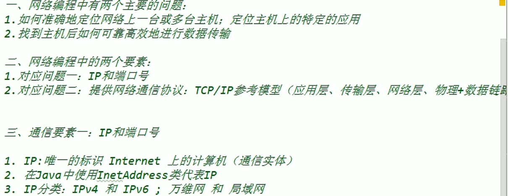
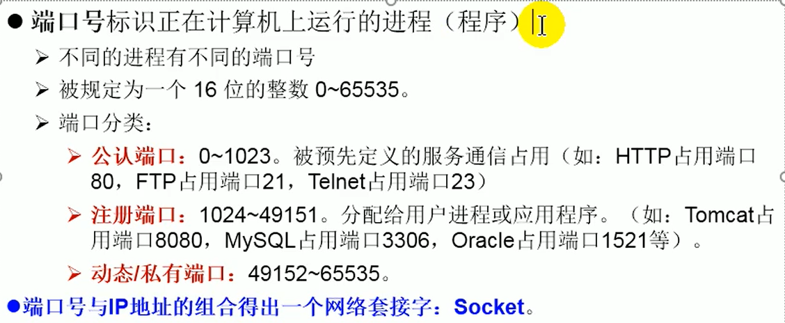

# 网络编程




* 4.域名：www.baidu.com

* 5.本地回路地址：127.0.0.1     对应着：Localhost

* 6.如何实例化InetAddress:两个方法: getByName(String host) 、 getLocalHost()

  ​	两个常用方法: getHostName() ：获取本机名字

  ​			         getHostAddress()：获取本机ip地址

### ip

```java
public class InetAddressTest {
    public static void main(String[] args) {
        try {
            InetAddress inet1 = InetAddress.getByName("192.168.10.14");
            System.out.println(inet1);

            InetAddress inet2 = InetAddress.getByName("www.baidu.com");
            System.out.println(inet2);

            InetAddress inet3 = InetAddress.getByName("127.0.0.1");
            System.out.println(inet3);

            //获取本机ip
            InetAddress inet4 = InetAddress.getLocalHost();
            System.out.println(inet4);

            System.out.println(inet4.getHostName());
            System.out.println(inet4.getHostAddress());


        } catch (UnknownHostException e) {
            e.printStackTrace();
        }
    }
}
```

### 端口号



## 实现TCP的网络编程

* 例子1:客户端发送信息给服务端，服务端将数据显示在控制台上

```java
public class TcpTest {
    @Test
    //客户端
    public void client() {

        Socket socket = null;
        OutputStream os = null;
        try {
            //1.创建了Socket对象，指明服务器端的ip和端口号
            InetAddress inet = InetAddress.getByName("127.0.0.1");
            socket = new Socket(inet,8899);

            //2.获取一个输出流，用来输出数据
            os = socket.getOutputStream();

            //3.写出数据的操作
            os.write("hello,server!".getBytes());

        } catch (IOException e) {
            e.printStackTrace();
        } finally {
            //4.资源的关闭
            if (socket != null) {
                try {
                    socket.close();
                } catch (IOException e) {
                    e.printStackTrace();
                }
            }

            if (os != null) {
                try {
                    os.close();
                } catch (IOException e) {
                    e.printStackTrace();
                }
            }
        }
    }


    @Test
    //服务器端
    public void server() {

        Socket socket = null;
        InputStream is = null;
        ServerSocket  ss = null;
        ByteArrayOutputStream baos = null;
        try {
            //1.创建服务器端的ServerSocket，指明自己的端口号
            ss = new ServerSocket(8899);

            //2.调用accept()表示接收来自的客户端的socket
            socket = ss.accept();

            //3.获取一个输入流
            is = socket.getInputStream();

            //不建议这样谢，可能会乱码
//            byte[] buffer = new byte[20];
//            int len;
//            while ((len = is.read(buffer)) != -1) {
//                String str = new String(buffer,0,len);
//                System.out.println(str);
//        }

            //4.读取输入流的数据
            baos = new ByteArrayOutputStream();
            byte[] buffer = new byte[20];
            int len;
            while ((len = is.read(buffer)) != -1) {
                baos.write(buffer,0,len);//存入baos内部数组
            }

            System.out.println(baos.toString());//从baos内部数组输出数据
            System.out.println("收到了来自于："+socket.getInetAddress().getHostAddress()+ "的数据");

        } catch (IOException e) {
            e.printStackTrace();
        } finally {
            //5.资源的关闭
            if (socket != null) {
                try {
                    socket.close();
                } catch (IOException e) {
                    e.printStackTrace();
                }
            }

            if (is != null) {
                try {
                    is.close();
                } catch (IOException e) {
                    e.printStackTrace();
                }
            }

            if (baos != null) {
                try {
                    baos.close();
                } catch (IOException e) {
                    e.printStackTrace();
                }
            }

            if (ss != null) {
                try {
                    ss.close();
                } catch (IOException e) {
                    e.printStackTrace();
                }
            }
        }
    }
}
```

* 例题2：客户端发送文件给服务端，服务端将文件保存在本地

```java
  //这里涉及到的异常应该使用try-catch-finally处理
        @Test
        public void client() throws IOException {

            Socket socket = new Socket(InetAddress.getByName("127.0.0.1"),9090);

            OutputStream os = socket.getOutputStream();

            FileInputStream fis = new FileInputStream(new File("1.jpg"));

            byte[] buffer=new byte[1024];
            int len;
            while ((len=fis.read(buffer))!=-1){
                os.write(buffer,0,len);
            }

            fis.close();
            os.close();
            socket.close();
        }

        @Test
        public void server() throws IOException {

            ServerSocket serverSocket = new ServerSocket(9090);

            Socket socket = serverSocket.accept();

            InputStream is = socket.getInputStream();

            FileOutputStream fos = new FileOutputStream(new File("4.jpg"));

            byte[] buffer=new byte[1024];
            int len;
            while ((len=is.read(buffer))!=-1){
                fos.write(buffer,0,len);
            }

            fos.close();
            is.close();
            socket.close();
            serverSocket.close();
        }
```

* 例题3：从客户端发送文件给服务端，服务端保存到本地，并返回“发送成功”给客户端，并关闭相应的连接

```java
//这里涉及到的异常应该使用try-catch-finally处理
@Test
public void client() throws IOException {
    //1.
    Socket socket = new Socket(InetAddress.getByName("127.0.0.1"),9090);
    //2.
    OutputStream os = socket.getOutputStream();
    //3.
    FileInputStream fis = new FileInputStream(new File("preview.jpg"));
    //4.
    byte[] buffer=new byte[1024];
    int len;
    while ((len=fis.read(buffer))!=-1){
        os.write(buffer,0,len);
    }

    //关闭数据的输出，如果不关闭，服务器端一直都在等待传输数据
    socket.shutdownOutput();

    //5.接受来自于服务器端的数据，并显示到控制台上
    InputStream is = socket.getInputStream();
    ByteArrayOutputStream baos=new ByteArrayOutputStream();
    byte[] buffer1=new byte[20];
    int len1;
    while ((len1=is.read(buffer1))!=-1){
        baos.write(buffer1,0,len1);

    }
    System.out.println(baos.toString());
    //6.
    baos.close();
    fis.close();
    os.close();
    socket.close();
}

@Test
public void server() throws IOException {
    //1.
    ServerSocket serverSocket = new ServerSocket(9090);
    //2.
    Socket socket = serverSocket.accept();
    //3.
    InputStream is = socket.getInputStream();
    //4.
    FileOutputStream fos = new FileOutputStream(new File("preview1.jpg"));
    //5.
    byte[] buffer=new byte[1024];
    int len;
    while ((len=is.read(buffer))!=-1){
        fos.write(buffer,0,len);
    }

    System.out.println("图片传输完成！");
    
    //6.服务器端给与客户端反馈
    OutputStream os = socket.getOutputStream();
    os.write("你好，客户端，你的文件已经收到".getBytes());

    //7.
    os.close();
    fos.close();
    is.close();
    socket.close();
    serverSocket.close();
}
```

## 客户端-服务端

* 客户端：

  自定义；浏览器

* 服务端：

  自定义；Tomcat服务器

## 实现UDP的网络编程


